## Summary ##
In Lunarium, you are a lone astronaut sent on a daring mission to establish the first colony on the moon.

The planet you call home grows increasingly crowded, and humanity needs a backup plan. In this strategy resource management game, you are tasked with mining for ores, cultivating food, and powering your growing colony as more civilians of Planet Earth are shipped offworld. In your quest to tame this barren rock, you can’t be everywhere at once.

Luckily, you’ve been equipped with LunaBots, which you can control from the many terminals in your lunar headquarters to manage the colony from a central location. Earth Command has tasked you with building quickly, so to boost resource acquisition, LunaBots have been equipped with advanced building techniques to get the colony up-and-running in about 10 minutes! Carefully manage your power grid, achieve a surplus of food for your growing colony, and triage whatever setbacks the hazardous environment of the moon throws at you! Become the first to achieve a stable, populous colony on the moon by meeting Earth Command’s population threshold!

## Project Resources

[Itch.io](https://hawkhobo.itch.io/lunarium)  
[Trailer](https://www.youtube.com/watch?v=dQwvocwWPB8)  
[Proposal](https://docs.google.com/document/d/1BND99DF8VDu08BmWQeBlosrSl8PL4FcekbvLlHaypSw/edit?tab=t.0#heading=h.i3tv2mxf7h7z)  

## Gameplay Explanation ##

The Manual

### Controls ###
Lunarium's controls are simple, and consist of WASD or the arrow keys for simple RTS-like movement. Hold shift to scroll faster in the game world. Pan on your trackpad to zoom
in and out of the game world. Left-click on buttons in the game world to open up their corresponding UI element, or perform an in-game event. If you select a building button, 
press left-click again to attempt to place a building in the world. Right-click or Escape, while holding the building, will delete the building from your cursor. Press 
escape to close any UI element you opened. If no other UI is open, it will instead open the in-game settings menu.

### Gameplay Loop ###
Lunarium is a resource management and building turn-based strategy game. The player (astronaut) is tasked with managing a colony, and is given a starting allowance to construct 
buildings which generate various resources that interplay with each other. The astronaut starts with just a headquarters, and must build up their colony accordingly. When the 
astronaut advances to the next turn, the yield of buildings (indicated in each building panel when it is clicked) will be added to their economy. The astronaut must manage these 
resources carefully, or they will lock their per-turn resource production. Every two turns, colonists are shipped to the moon by a shuttle, and the astronaut must make sure they 
can support this population. The astronaut wins the game when they reach a colony population of 100. The astronaut loses the game if their colony starves, and reaches a 
population of 0.

### Buildings & Resource Types ###
1) Refinery - this building generates iron per-turn. Iron is used to construct all the buildings in the game, including the iron refinery itself. This is an important resource 
to generate other resources. 

2) Reactor - The reactor is capable of generating electricity, which takes effect immediately and is not on a per-turn basis. Electricity goes towards the power grid quota, 
which is important to keeping buildings powered and functioning properly. More detail on electricity generation can be consulted in the "The Power Grid" section below. 

3) Eco Dome - The eco dome generates food on a per-turn basis, and is necessary to keep your colony alive. Failure to supply the appropriate amount of food will cause colonists 
to die on a per-turn basis. If you lose all your colonists, your colony fails. Details are discussed further in the "Consumption and Starvation" section below including the
subtleties of their cost.

4) Residence - This building houses colonists, and does not generate any particular resources, but they are important toward winning the game (especially if one wishes to win
the game quickly). More information in "Colonial Shuttles" on how these buildings work.

5) Headquarters - The headquarters is what the astronaut starts with, and is primarily there for aesthetic (a planned but unimplemented feature was for it to house a tech tree!).
Note this building generates one iron per turn so that the player isn't hardlocked out of the economy if they've made some errors.

Each building has an intrinsic cost on deployment in terms of iron and electricity, and can be consulted by clicking the building button associated with the given building. 
Only the reactor does not cost electricity. Both resource costs are extracted immediately during the turn. To see the exact costs, check out the "Upgrading" section.

### Colonial Shuttles ###
Every two turns, Earth Command sends a shuttle, laden with incoming colonists, to the colony. These colonists need a place to live, or they will be turned back, so the astronaut
must build residency buildings to support them. The astronaut should carefully monitor their population limitations to ensure they can lodge the incoming colonists. Each 
residency supports 10 colonists, to start, and each shuttle sends 10 colonists. 

### The Power Grid ###
The power grid refers to the non-turn based system in which buildings consume power, inspired by Supreme Commander (but certainly not as complicated). Buildings require
power, and if the astronaut exceeds their power budget, the constructed building will shut down. It will not generate resources on the next turn unless the power budget is 
increased, by creating another reactor.

### Consumption and Starvation ###
At the end of every turn, colonists will consume food. Each colonist consumes a single food unit. If the food stockpile at the end of a turn is lower than the population, then
the difference between them becomes the number of starving colonists. This number is then divided in half, and rounded to the nearest whole integer, and becomes the amount of
colonists which will die on the next turn. This is how you lose the game.

### Upgrading ###
Buildings are upgradeable in their respective building panel. They produce more, cost more, and deliver more power draw on the power grid. A full breakdown of their scalar values
can be seen below, upgrade-to-upgrade:

  #### Refinery ####
| Cost | Production (Iron) | Power Draw |
| :------ | :----------   | :------    |
| 10      |     4         | 10         |
| 15  | 8| 15|
| 20    | 12| 20|

  #### Reactor ####
| Cost    | Production (Electricity) | Power Draw |
| :------ | :----------   | :------    |
| 10      |     10         | 0         |
| 15  | 20| 0|
| 20    | 30| 0|

  #### Residential ####
| Cost    | Production (Population) | Power Draw |
| :------ | :----------   | :------    |
| 10      |     20         | 10         |
| 15  | 40| 15|
| 20    | 80| 20|

  #### Eco Dome ####
| Cost    | Production (Food) | Power Draw |
| :------ | :----------   | :------    |
| 10      |     10         | 10         |
| 15  | 20| 15|
| 20    | 30| 20|

### Destroying ### 
If you misplace a building, or simply wish to remove it, you can do so by clicking the destroy button!

### Turn-based Strategies ###
We list a few strategies below to get you started (but we don't want to spoil the whole game :-) ):
* First, monitor your power grid carefully. Ensure that you are not needlessly constructing buildings that can't be powered on the current turn.
* Get some food quick to support incoming colonists! Watch that shuttle every 2 turns. When the colonists come in, you want to be able to feed them (this is the easiest resource
  to forget about, we have found).
* Get a running refinery up immediately. It produces iron 4.0x higher than the standalone headquarters.

# External Code, Ideas, and Structure #

## Tutorials Used

* [Ultimate Godot AnimationTree Tutorial - They Are Not Scary!](https://www.youtube.com/watch?v=E6ajmQhOeo4)
* [Godot UI Basics - how to build beautiful interfaces that work everywhere (Beginners)](https://www.youtube.com/watch?v=1_OFJLyqlXI)
* [How To Fix Blurry Pixel Art in Godot!](https://www.youtube.com/shorts/p5Gm1DeqXcg)
* [ Using Github To Build Your Game! Creating a Ci/CD System Using Github Actions!](https://www.youtube.com/watch?v=bIXBosDO6f8) 

## Color Vision Deficiency Matrices

All code for the CVD plugin was written in-house by Wen Kai.

The color deficiency simulation matrices for our CVD Simulator plugin (`addons/cvd_sim) were based on the full strength CVD matrices from
[*A Physiologically-based Model for Simulation of Color Vision Deficiency*](https://www.inf.ufrgs.br/~oliveira/pubs_files/CVD_Simulation/CVD_Simulation.html).
That paper was found through the [Firefox Source Docs](https://firefox-source-docs.mozilla.org/devtools-user/accessibility_inspector/simulation/index.html).

The matrix for achromatopsia (monochrome vision) was based on [the GIMP luminance equation](https://docs.gimp.org/2.10/en/gimp-filter-desaturate.html).

## Label/Button scaling

The article ["The simplest way to scale UI in Godot"](https://humnom.net/thoughts/67b7374e-the-simplest-way-to-scale-ui-in-godot.html) was referenced when researching approaches to text scaling.
We ultimately took a different approach for scaling.

# Team Member Contributions

## Jacob Feenstra ([Hawkhobo](https://github.com/Hawkhobo)) ##

Note I will organize everything in a list and by Pull Request (where PRs are applicable), so that you can quickly see exactly what code is submitted. Click on the toggles below.

### Producer ###

Deliverables

I really enjoyed my role as producer, and the minutiae of managing a team creating a full-stack software
application :). I'll go ahead and list things chronologically and evidently.

1) *Discord Server* - Initially, I organized and set up our Discord within the first few days of our team being assembled. We have used it extensively since (and I mean _really_ extensively).
It's become a bit of a commmunity!

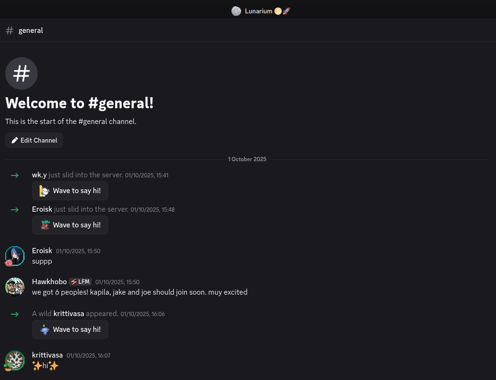 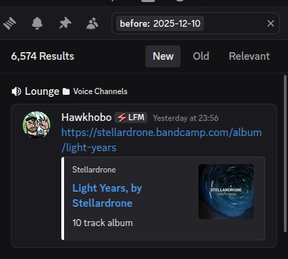

that's a whole lotta blabbing! I believe it helped us remain communicative from Day 1. Any communication breakdown we experienced was certainly lessened.

2) *Google Drive* - From there, I setup a Google Drive for the management side of the project, that would help us stay organized and get things done, `ecs_179_team_lunarium`. We collected a 
decent amount of addendum documentation there. 

3) *Weekly Meetings* - One of my larger contributions as producer was hosting weekly meetings, which we kept up for approximately six weeks. We did not meet the last two weeks. I prepared with an
itinerary prior to each meeting, and would take notes. One of the example weekly meetings is below.

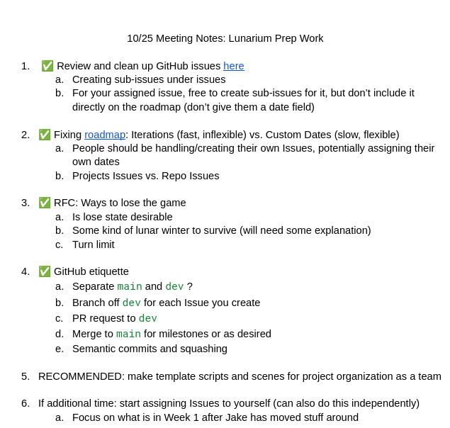

4) *GitHub Organization* - Then, I set up the GitHub organization that we are currently using. My intent was to make sure that not any one of us "owned" the game, and instead, we were equal partners.

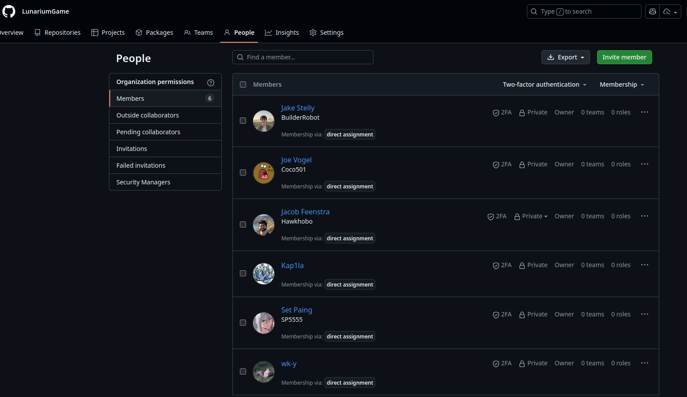

5) *GitHub Projects* - I also felt it was important to set up a Gantt chart to stay organized during the course of development, especially due to how involved such a project can be. To keep things
integrated with Github, I tried out the GitHub Projects Roadmap view. I have to admit: I found this feature slightly lackluster (especially because it can't be exported to be
viewed elsewhere, which feels like a glaring missing feauture...), but after much experimentation, I think it did a fine job of keeping us on track. This is the Projects in it's
current state (you can also see we didn't implement everything :/):

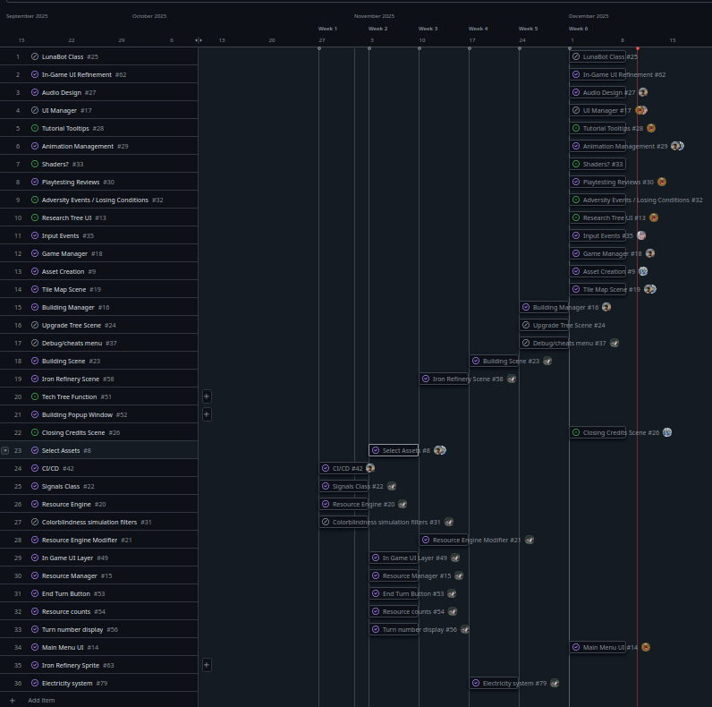

6) *GitHub Workflow* - I set up most of the issues in that Projects Roadmap, consulting with my team as I did so, and it really helped us stay organized in the early days and tackle problems
independently. We also extensively used PRs for implementing these issues, among other things. 

7) *GitHub Actions* - As producer, I also set up a GitHub Actions workflow for automatic deployment to our itch.io page. This was some serious trial & error and wrestling, but I'm happy I did it.
I was even able to set it up in such a way that each Repository branch would be built to a different itch.io stream on a push, which was really nice for us to
test different features in isolation on itch.io. It definitely made things a lot smoother and less scrambly come submission time. You can check it out at 
`.github/workflows/build-on-push.yaml`. I also set up the itch.io page itself.

8) [*Documentation*](https://github.com/LunariumGame/Lunarium/pull/211) - I wrote the game's user manual.

9) *Miscellaneous* - Other producer functions included delegating tasks, handling conflicts between team members, and rallying the team for the final push we had the weekend 
before the demonstration. We had some serious difficulties during the lifetime of this project, but it has been an exceptional learning experience and deeply meaningful. 
I will always keep a piece of Lunarium with me I think.

### Game Feel ###

Deliverables

Game feel was a lot of fun too! I ended up focusing on core system implementation, but fortunately, all of the ones I implemented had the chance to introduce a lot of juice.
Please refer to "Audio", "Animations", and "Movement/Physics" for more game feel contributions. I feel it is too confusing to try and distill the implementation from the game
feel, and makes more sense to just have it one place. But I do have some standalone game feel contributions here!

1) [*Cursor Buildings Pulsate*](https://github.com/LunariumGame/Lunarium/pull/204) - I introduced a fun little detail that allows your selected building to pulsate prior to
  placement. I feel it added quite a bit of feel! It certainly makes the world just that much more lively. The code was adopted from Joe Vogel's code, which makes the logo
pulsate in our main menu and settings scenes.

2) [*Animations for On & Off Buildings*](https://github.com/LunariumGame/Lunarium/pull/199) - This was not quite a complete fix, and Joe would extend the code in a later PR, but
  it enables buildings to turn on & off (switch between the off animation and the idle animation). We didn't quite have that yet. 

3) [*Fix Building Collisions*](https://github.com/LunariumGame/Lunarium/pull/143) - I needed to tune the Area2D of each building slightly for proper placement on the grid.
Basically, if placement is disallowed due to collisions, then the Area2D's cannot simply be diretly adjacent to each other, as they touch on an edge. I tuned the area size to be
  98%, and that seemed to do the trick.

### Other Contributions ###

Deliverables

#### Audio ####

One of my major contributions, but not necessarily listed on my initial roles, was engineering all of the sound design in the game. I am pretty happy with the finished product,
even if I wanted to implement even more. Here is a rundown.
by

1) [*Victory & Defeat Scores*](https://github.com/LunariumGame/Lunarium/pull/198) - Added the score for the victory and defeat cutscenes at the end of the game. Didn't do any
mixing in Audacity here, since I wanted them to play abruptly.

<ul>
     <li>S: <a href="https://freesound.org/people/eardeer/sounds/423692/">WeDidIt.wav</a> by <a href="https://freesound.org/people/eardeer/">eardeer</a> | License: <a href="https://creativecommons.org/licenses/by-nc/4.0/">Attribution NonCommercial 4.0</li>
     <li>S: <a href="https://freesound.org/people/InAvision/sounds/479259/">Aftermath.aif</a> by <a href="https://freesound.org/people/InAvision/">InAvision</a> | License: <a href="http://creativecommons.org/publicdomain/zero/1.0/">Creative Commons 0</li> 
</ul>

2) [*Intro Score*](https://github.com/LunariumGame/Lunarium/pull/196) - Here, I included the score for the introductory cutscene in the game. This one _was_ mixed in
Audacity, in seguing to the main menu of the game.

<ul>
     <li>S: <a href="https://freesound.org/people/ViraMiller/sounds/747938/">Deep and Mysterious Music for Cosmic Themes</a> by <a href="https://freesound.org/people/ViraMiller/">ViraMiller</a> | License: <a href="https://creativecommons.org/licenses/by/4.0/">Attribution 4.0</li> 
</ul>

3) [*Building Audio and Manager*](https://github.com/LunariumGame/Lunarium/pull/175/) - This was the largest contribution for audio, and surprisingly time consuming.
Each building contains 2 shared audio sounds (create and destroy), and a unique one for when it is selected.

<figure>
    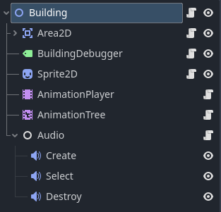
</figure>

In terms of player interaction with the buildings, I wanted to introduce some neat management for immersion. Most of the code lives in `manage_audio.gd`. Essentially:
1) The creation sound will not be interrupted when a building is placed in the world
2) For a single building, a player cannot repeatedly "spam" a particular sound
3) For a single building, triggering a new sound will interrupt the old sound (unless it is the original creation sound)
4) Different buildings can play different sounds at the same time, with no upper bound.
5) Each building has it's own positional audio in the environment.

<ul>
     <li>S: <a href="https://freesound.org/people/ViraMiller/sounds/747938/">Deep and Mysterious Music for Cosmic Themes</a> by <a href="https://freesound.org/people/ViraMiller/">ViraMiller</a> | License: <a href="https://creativecommons.org/licenses/by/4.0/">Attribution 4.0</li> 
</ul>

#### Animations & Visuals Logic ####

Kapila gets full credit for designing the visuals in Aseprite, but I did build a somewhat sophisticated AnimationTree to manage them, and helped them to feel just right in the
game. I'll talk technical details here, since a lot of the game feel is described earlier.

[*AnimationTree for all Building Scenes*](https://github.com/LunariumGame/Lunarium/pull/148) - This is a big one. I spent quite some time putting together an animation tree
logic which would correspond across the board for all buildings (except for headquarters, which just runs an idle animation during the game). This involves a scened animation
tree extended across several building scenes. Notice there is a "buff" animation here that didn't make it to the base game :(

1) First, the animation player, which contains all of the frames used in our game. It consists of the following keys. I hand-animated each of them.
<figure>
    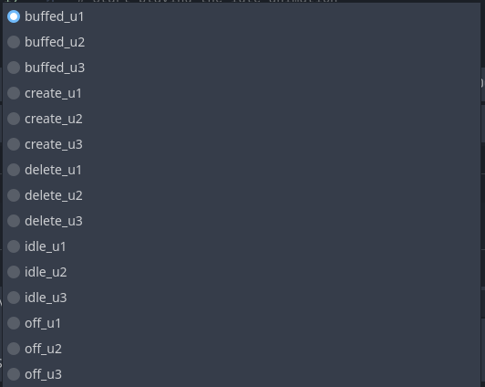
</figure>

2) Then, the AnimationTree, which uses these animations. This logic is pretty involved, but it effectively defines reasonable transitions between all the building states. Some
play automatically, others wait, and even others are slightly blended. I think the finished product is pretty cool.

<figure>
    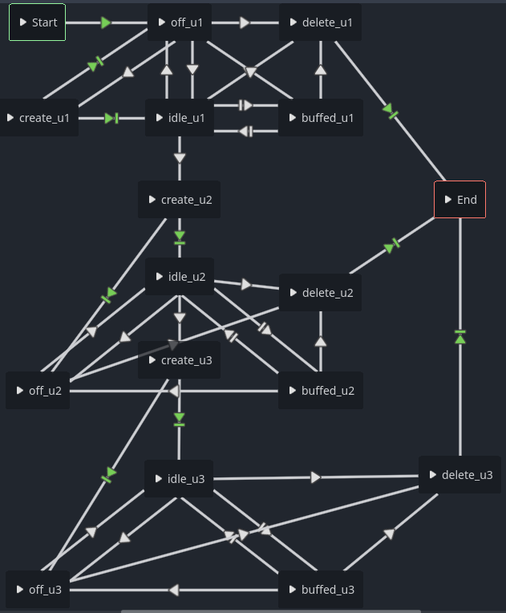
</figure>

3) I then created an autoloaded API to invoke the animation tree relatively easy anywhere in the project, which I thought was pretty handy for the rest of the team. By passing
in an enum (OFF, DELETE, CREATE, UPGRADE, BUFFED, IDLE) you can get the animation you want. The upgrade level is automatically resolved by referencing the building scene's 
current upgrade level in the script. `travel()` is also called internally. All you need to do is is call `update_animation()` with the enum in the part of the game logic you're
interested in! (NOTE: there was an edge case between create -> off transition that explicitly required an auto playback conditional, due to conflicting animations. Joe implemented that. It can be viewed in `building.gd`)

#### Movement/Physics ####

Attribution: LLM agents (primarily Gemini, and a little bit of Claude) was used to assist me in debugging my code. The base sytems were written by me, and I did not use LLM's for that aspect of development.

I was fortunate enough to implement the building placement system in the game, which I have decreed our "physics system". It took a lot of push-and-pull, and I even fully 
refactored it at one point (with help of Wen Kai's suggestions). I think the final product is was quite significant & neat! I'll just go over the big, final PR:

[*Animation Keyframes for Buildings, Refactoring Building Cursor*](https://github.com/LunariumGame/Lunarium/pull/139) - This was my most difficult PR and touched many systems,
but effectivey, Wen Kai helped me realize the building cursors (what I classified as the transparent building that follows the in-game cursor when the player clicks to build a
buildig) were a bit overengineered. I agreed and was not happy with it. This also naturally came to fruition when I was adding the frames from the spritesheets, and realized I
wanted an Area2D environment for each building. After much difficulty, I got it to work. I spent literal days trying to figure out canvas layer translations (translating between
coordinate spaces in Godot is really nasty, turns out). I had multiple canvas layers enforcing the z-index locations for the cursor building, the placed buildings, the world, the
UI, etc. I ended up ripping all of that out when I realized z-index was an intrinsic value native to each node (I am not sure how I missed this, I wish I didn't, but all's well
ends well).  I also refactored for placement disallowment to simply be Area2D overlaps between the Building type, which involved translating the cursor building's coordinates out
of the HUD canvas layer and into the world. There's a lot of work that went into this system. Here's more relevant PRs in chronological order if you wish to
get situated with the code:

1) [*Backend Building Asset DB & Building Cursor Functionality*](https://github.com/LunariumGame/Lunarium/pull/75) - Very first PR, a lot of code. Much was refactored, and the
asset DB was ultimately removed. The core building cursor logic stayed the same, but there was much refactoring in approach in the big PR above. Also includes an active button
tracker so that the player can easily switch between cursor buildings when clicking between buttons.

2) [*Building Snap Placement & Placement Restriction*](https://github.com/LunariumGame/Lunarium/pull/88) - Moving the building with your cursor creates a grid-like snapping
movement, in the style of older RTS games (inspired mostly by Age of Empires II, one of the best games ever made). It doesn't do this for other gametime events, which felt
important. Also the first stab at restricting building placement on the map.

#### Miscellaneous ####

1) [*Fetch Building Node util*](https://github.com/LunariumGame/Lunarium/pull/172) - All the buildings in the game are mapped to a unique whole integer, an `id`. I made a method
which would globally return the live building node given the id, since a lot of our frontend just uses the id. I actually didn't end up using it all too much.

## Joe Vogel ([Coco501](https://github.com/Coco501))

### User Interface and Input
  - [Settings menu](https://github.com/LunariumGame/Lunarium/pull/40)
  - [Main menu styling (& much more)](https://github.com/LunariumGame/Lunarium/pull/205)
  - In-game UI 
    - [Many iterations on the overall layout & design](https://github.com/LunariumGame/Lunarium/pull/147)
    - [Oldsteam theme](https://github.com/LunariumGame/Lunarium/pull/152)
    - [Inspector panel](https://github.com/LunariumGame/Lunarium/pull/168)
  - Controls
    - [Camera speed & zoom](https://github.com/LunariumGame/Lunarium/issues/35)
    - [Hotkeys and input control (Space, ESC, B, Right-click, Shift, etc.)](https://github.com/LunariumGame/Lunarium/pull/163)
    - [World borders](https://github.com/LunariumGame/Lunarium/pull/150)

### Gameplay Playtesting
  - Conducted 9 playtesting sessions
    - [Official Playtesting Document](https://docs.google.com/document/d/1mVwciQaqRTi5cSQx_DC_5bwGkvSAjFtnQ4yakBuf55s/edit?tab=t.nqudi14ugpnn)
  - Made an external document for playtesters to fill out themselves
    - [External Playtesting Document](https://docs.google.com/document/d/1wc2hWlAAw7NJTlG1Mo9_kOsT3hX_q5pVRvdjqzl0JZ4/edit?tab=t.0)
  - Balanced the game and prioritized features based on playtester feedback
    - [Highlighting buildings on hover](https://github.com/LunariumGame/Lunarium/pull/174)
    - [Audio being too loud](https://github.com/LunariumGame/Lunarium/pull/205)
    - Resource balancing

### Other contributions
  - Systems integrations
    - [Building manager UI hookup](https://github.com/LunariumGame/Lunarium/pull/168)
  - Asset contributions and research 
    - [Drew resource, logo, and cursor sprites](https://github.com/LunariumGame/Lunarium/tree/dev/assets/sprites)
    - [Concept art designs](https://imgur.com/a/sxaUOWV)
    - Sourced the game logo and rotating moon animation 
    - Sourced initial soundtrack
  - Minor team organization tasks
  - Game balancing
  - Animation refinements
    - [Fixed opening cutscene bugs](https://github.com/LunariumGame/Lunarium/pull/203)
    - [Gave input on the length of animations, as well as crucial bug fixes in the building animation tree](https://github.com/LunariumGame/Lunarium/pull/205)
  - [Hooked up lose and win screen logic](https://github.com/LunariumGame/Lunarium/pull/189)
  - [Configured global project settings](https://github.com/LunariumGame/Lunarium/pull/43) (resolution, load screen, logo, etc.)

## Wen Kai Yiang ([wk-y](https://github.com/wk-y))

### Systems and Tools Engineer

[Documentation for our tooling can be found here.](ToolsDocumentation.md)

I designed and implemented the following tools and systems:

* Colorblindness simulator plugin - for use by UI, Asset, and Accessibility roles:
  * [Colorblindness simulator implementation](https://github.com/LunariumGame/Lunarium/pull/39)
  * [Refactor into an editor plugin](https://github.com/LunariumGame/Lunarium/pull/45)
* Resource system:
  * Resource engine - stores and updates player's resource counts, handles upgrade modifiers
    * [Resource engine](https://github.com/LunariumGame/Lunarium/pull/41) - implementation of engine and framework for upgrade modifiers 
    * [Conditional modifiers](https://github.com/LunariumGame/Lunarium/pull/87) - framework for modifier conditions, implements a modifier to apply based on class
  * Electricity generation mechanics
    * [Implementation](https://github.com/LunariumGame/Lunarium/pull/80)
    * [Configuration](https://github.com/LunariumGame/Lunarium/pull/137)
    * [Building debug overlay](https://github.com/LunariumGame/Lunarium/pull/138) - used to debug power status
* [NotificationManager](https://github.com/LunariumGame/Lunarium/pull/184) - processes event signals into textual notifications
* [UiScaleManager](https://github.com/LunariumGame/Lunarium/blob/dev/scripts/managers/ui_scale_manager.gd) - manages the current scale setting of the UI
   * [Label scaling](https://github.com/LunariumGame/Lunarium/pull/64) - scales labels
   * [Button scaling](https://github.com/LunariumGame/Lunarium/pull/102) - scales buttons using the theme
* [Crater background PCG](https://github.com/LunariumGame/Lunarium/pull/140) - randomly placed craters for a more organic background

### Accessibility and Usability Design

I implemented UI scaling and cursor scaling mechanisms.
I worked closely with the UI team to ensure our UI is accessible.

Checklist (some features were implemented by the UI team):

- [x] Sound mixing can be adjusted
- [x] [WCAG text color contrast standards met](https://webaim.org/resources/contrastchecker/?fcolor=FFFFFF&bcolor=4C5844)
- [x] UI scale adjustable
- [x] Assist in finding cursor by enlarging it when shaken (both useful and fun)

#### Accessibility Comparisons

The following are screenshots demonstrating accessibility improvements made.

##### Contrast

Before contrast improvement:  
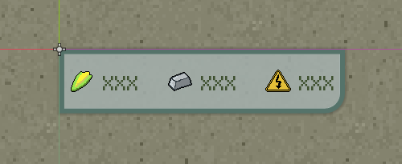

After contrast improvement:  
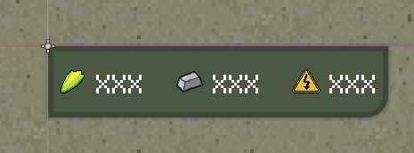

##### Scale

1x scale:  

Maximum (3x) scale:  
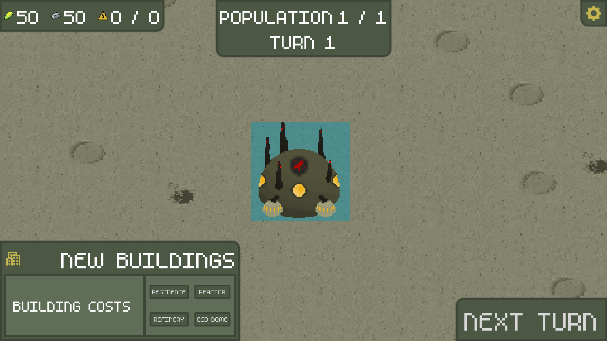

Due to implementation time constraints, icons were left unscaled.

### Core game mechanics
* [Population growth shuttle](https://github.com/LunariumGame/Lunarium/pull/113) - provides the colony with population increases
* [Starvation](https://github.com/LunariumGame/Lunarium/pull/109) - kills colonists when food runs out
* [Win condition check](https://github.com/LunariumGame/Lunarium/pull/107) - win when population target is met
* [Game loop](https://github.com/LunariumGame/Lunarium/pull/55) - handles game updates between turns

### Other contributions

* [Ensured our issue tracker was up to date by creating many of our tracking issues](https://github.com/LunariumGame/Lunarium/issues?q=is%3Aissue%20author%3Awk-y)
* [Triaged our critical issues](https://github.com/LunariumGame/Lunarium/issues?q=is%3Aissue%20label%3Ap1-critical)

## Set Paing

### Game Logic
- Organized the project using the "mirrored" directory structure. Scenes live in the `scenes` folder, scripts in the `scripts` folder, and both follow the same layout for clarity.
- Built a UI stack manager that controls the order of opening and closing windows (e.g., handling ESC/back actions). It tracks all active UI and sets the foundation for the heavier menu interactions in the game.
- Moved all UI elements out of the main `world` scene into separate scenes like `hud` for cleaner integration.
- Updated UI nodes to be fully responsive across different aspect ratios, on both windowed and fullscreen modes.
- Implemented the Main Menu scene.
- Designed the data flow between major systems such as `game_manager`, `resource_manager`, `building_manager`, etc.
- Implemented the "building popup" window on the bottom-left corner and set up the data flow between buildings and the UI.
- Defined the execution order of building logic at end-of-turn (e.g., power plants generate electricity before anything consumes it).
- Added building upgrade functionality.

### Game Feel
- Improved the readability of the top-left resource bar.
- Implemented the max population and electricity cap mechanics.
- Fixed the issue where buildings could be placed under invalid conditions (lack of required resource, out of bound placements, etc).
- Cleaned up and streamlined signaling between systems.
---

## Jake Stelly ([BuilderRobot](https://github.com/BuilderRobot)) ##

### Systems Engineer

[Player movement and camera](https://github.com/LunariumGame/Lunarium/blob/a76b21bcdd7e4796f20829fa1d1174d7550700f9/scripts/core/player.gd#L1)
* Normalized vector movement
* Position lock camera

[Resource modifiers](https://github.com/LunariumGame/Lunarium/blob/a76b21bcdd7e4796f20829fa1d1174d7550700f9/scripts/ui_components/basic_resource_modifier.gd#L1)
* [Abstract superclass](https://github.com/LunariumGame/Lunarium/blob/a76b21bcdd7e4796f20829fa1d1174d7550700f9/scripts/ui_components/resource_modifier.gd#L1)
* Works with ResourceManager to boost the amount of resources given
* Apply times
   * Immediately
   * On build
   * End of turn
* Sorted by resource type
* Stored and manager in a new section of ResourceManager

[Tech tree upgrade resources](https://github.com/LunariumGame/Lunarium/blob/a76b21bcdd7e4796f20829fa1d1174d7550700f9/scripts/ui_components/tech_tree_node.gd#L1)
* Resource for designing a tech tree spec
* Cost dictionaries
* Cost managment and upgrade application logic
* Mutable list of resource modifiers
* [Resource class](https://github.com/LunariumGame/Lunarium/blob/a76b21bcdd7e4796f20829fa1d1174d7550700f9/scripts/ui_components/tech_tree_node_spec.gd#L1)

[Building Manager](https://github.com/LunariumGame/Lunarium/blob/a76b21bcdd7e4796f20829fa1d1174d7550700f9/scripts/managers/building_manager.gd#L1)
 * Dictionary of unique building IDs
 * Map of existing buildings
 * Adjacency detection for multi-tile buildings
 * Total building count sorted by type
 * Accessors for adjacency, ID, and type
 * Build functionality with cost management and detection of existing buildings
 * Query function for implementation with cursor hovering
 * Cost tracking for building levels

[Upgrade Database](https://github.com/LunariumGame/Lunarium/blob/6274fadce42136adbb985a5803a375f001695c9c/scripts/managers/tech_tree_manager.gd#L1)
* Automatically load spec resources into a list of wrapper objects
* Arrange upgrades by tier
* Random, duplicate-avoiding getUpgrade functions

### Performance Optimization
Made drastic improvements to the efficiency of the BuildingManager class following the size increase of the map
* Check out the evolution of my planning, algorithms, and profiling below
* [Optimization Document](https://docs.google.com/document/d/1KPvbdcfLBMDYctRfjjSjAQSfdUCGkGZ_MBPcH52fjNQ/edit?tab=t.0)

## Kapila Mhaiskar ([Kap1la](https://https://github.com/Kap1la))

### Animations & Visuals
Made all building sprites & animation sequences (Jacob actually set up the animations and their timing in Godot), background tileset, cutscenes, ending banners, and credits screen.

[Concept Art Sketches](https://imgur.com/a/zJYgKgt)

[Concept Art Aseprite](https://imgur.com/a/oLj6Tvg)

### Visual Cohension & Style Guide, Narrative Design + Animation & Visual Style Guide
[The Style Guide](https://docs.google.com/document/d/1p8EXoz7k58oNd6SpOBj2jET6y-thP62O2PWdukOd0kM/edit?usp=sharing)

* Set up opening cutscene, ending banners scene, and credits scene.
* Implemented logic to allow for continued play after victory and credits that will not check for victory again, but will check for defeat
* Implemented logic to close the game after the post-defeat credits

### Third-Party Assets
<u>Fonts</u>  
<i>[m5x7](https://managore.itch.io/m5x7)</i> by Daniel Linssen - Creative Commons License  

<u>Sprites</u>  
<i>[Lunarium Title](https://chatgpt.com/)</i> by ChatGPT - Free Use  
<i>[Rotating Moon](https://deep-fold.itch.io/pixel-planet-generator)</i> by Deep-Fold - MIT License  
<i>[Settings Cog](https://kenney.nl/assets/mobile-controls)</i> from Kenney.nl - Creative Commons

<u>Shaders</u>  
<i>[Lightweight Pixel Perfect Outline](https://godotshaders.com/shader/lightweight-pixel-perfect-outline/)</i> by flytrap - Creative Commons

<u>Music</u>  
<i>[Space Music Pack](https://gooseninja.itch.io/space-music-pack)</i> by Goose Ninja - Free Use  

<u>Effects</u>  
<i>[Star Twinkle](https://pixabay.com/users/koiroylers-44305058/?utm_source=link-attribution&utm_medium=referral&utm_campaign=music&utm_content=355937)</i> by Koi Roylers, Pixabay - [License](https://pixabay.com/service/license-summary/)

### Original Assets
<u>Sprites</u>  
[Buildings](https://github.com/LunariumGame/Lunarium/tree/0f09a4f6cabe73c468ec39446b6e8a3da943bfef/assets/sprites/buildings) by Kapila Mhaiskar  
[Cutscenes](https://github.com/LunariumGame/Lunarium/tree/0f09a4f6cabe73c468ec39446b6e8a3da943bfef/assets/sprites/cutscenes) by Kapila Mhaiskar  
[Tilemap](https://github.com/LunariumGame/Lunarium/tree/0f09a4f6cabe73c468ec39446b6e8a3da943bfef/assets/sprites/tilemap) by Kapila Mhaiskar

<i>Moon Logo<i> by Joe Vogel      
<i>Cursor</i> by Joe Vogel  
<i>Resource icons</i> by Joe Vogel  
